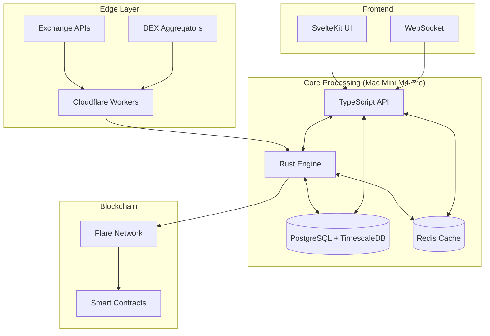

# 🚀 PROJECT CHRONO - FTSO Oracle

_"Chrono boost activated! Time is a flat circle, but prices are multidimensional."_

## 🎮 StarCraft 2 Themed FTSO Oracle

Project Chrono is a high-performance Flare Time Series Oracle (FTSO) implementation featuring a hybrid edge + self-hosted architecture. Built with the efficiency and strategic thinking of the Protoss, it combines Rust's performance with TypeScript's ecosystem for optimal price data processing.

### ⚡ Key Features

- **Multi-Source Price Aggregation**: VWAP, TWAP, weighted median calculations with ML-powered outlier detection
- **Hybrid Architecture**: Edge collection via Cloudflare Workers + self-hosted Mac Mini M4 Pro processing
- **High Performance**: Rust core engine with TypeScript API layer using Bun runtime
- **Real-Time Updates**: WebSocket streaming with Redis pub/sub for instant price feeds
- **Enterprise Monitoring**: Prometheus + Grafana with custom FTSO metrics and SLA tracking
- **Production Security**: Multi-layer security, automated backups, disaster recovery

## 🏗️ Architecture Overview



## 🎯 StarCraft 2 Themed Components

### 🏗️ Nexus Construction (Core Infrastructure)

- **Mac Mini M4 Pro**: The command center powering all operations
- **Multi-Language Runtime**: Rust + TypeScript + Bun + Deno toolchain
- **Database Cluster**: PostgreSQL with TimescaleDB + Redis cache
- **Security Systems**: Advanced hardening and monitoring

### ⚡ Chrono Boost Network (Data Collection)

- **Cloudflare Workers**: Edge-distributed price collection
- **Exchange Integration**: Coinbase, Binance, Kraken, Bybit, OKX
- **Data Validation**: Real-time outlier detection and filtering
- **Rate Management**: Smart quota and error handling

### 🧠 Khala Connection (ML & Analytics)

- **Rust Core Engine**: High-performance price aggregation
- **ML Pipeline**: Anomaly detection and market prediction
- **Consensus Algorithm**: Multi-source truth determination
- **Performance Optimization**: Zero-copy operations and SIMD

### 🌐 Warp Gate Portal (User Interface)

- **SvelteKit Dashboard**: Modern, reactive user interface
- **Real-Time Updates**: WebSocket price feeds and notifications
- **Wallet Integration**: MetaMask, WalletConnect support
- **Analytics**: Performance metrics and delegation tracking

### ⚔️ Protoss Fleet (Flare Integration)

- **FTSO Submission**: Automated price oracle submissions
- **Smart Contracts**: Delegation and reward management
- **Reward Distribution**: Automatic FLR reward calculations
- **Network Monitoring**: Competition analysis and optimization

## 🚀 Quick Start

### Prerequisites

- macOS (Mac Mini M4 Pro recommended)
- Internet connection for downloading packages

### Development Environment Setup (15-20 minutes)

1. **Clone the repository**

   ```bash
   git clone https://github.com/alexsmith84/project-chrono.git
   cd project-chrono
   ```

2. **Run the automated setup script**

   ```bash
   ./scripts/helpers/dev-setup-auto.sh
   ```

   This will automatically install:
   - Homebrew (if not present)
   - Rust toolchain (rustc, cargo, clippy, rustfmt)
   - Bun runtime (JavaScript/TypeScript)
   - PostgreSQL 16 with TimescaleDB
   - Redis cache
   - Development tools (git, gh, jq)

3. **Verify installation**

   ```bash
   rustc --version    # Should show 1.90+
   bun --version      # Should show 1.2+
   psql --version     # Should show 16.10+
   redis-cli ping     # Should return PONG
   ```

4. **Install project dependencies**

   ```bash
   bun install
   ```

**For detailed setup instructions, see:**

- Automated Setup: `docs/implementation/CHRONO-003-guide.md`
- Manual Setup: `docs/setup/mac-mini-setup.md` (production hardening)
- Verification: `docs/tests/CHRONO-003-tests.md`

## 🔗 Live Deployment

When deployed, Project Chrono will be accessible at:

- **🏗️ Main Oracle**: `nexus.hayven.xyz` - Core FTSO hub and API
- **🔍 Data Collection**: `probe.hayven.xyz` - Edge data collection status
- **🧠 Analytics**: `forge.hayven.xyz` - ML processing and insights
- **🌐 Public API**: `gateway.hayven.xyz` - Developer API access
- **⚔️ Admin Dashboard**: `templar.hayven.xyz` - System monitoring and control

## 📊 Performance Targets

| Component         | Performance Target       | Technology               |
| ----------------- | ------------------------ | ------------------------ |
| Price Aggregation | <10ms calculation        | Rust                     |
| API Response      | <200ms (95th percentile) | TypeScript/Bun           |
| WebSocket Updates | <50ms latency            | Redis pub/sub            |
| Database Queries  | <50ms complex queries    | PostgreSQL + TimescaleDB |
| System Uptime     | 99.9% availability       | Multi-layer redundancy   |

## 🏷️ Team Composition (StarCraft Themed)

- **🟡 Probe** - Data Engineering (Resource gathering from exchanges)
- **🔵 Zealot** - Frontend Development (First contact with users)
- **🔴 High Templar** - Blockchain Integration (Powerful Web3 abilities)
- **🟢 Marine** - DevOps & Infrastructure (Reliable backbone)
- **🟣 Overlord** - Backend Development (Oversees system architecture)
- **🟠 SCV** - Quality Assurance (Maintains code quality)

## 🎫 Development Workflow

### Project Management

- **GitHub Projects**: Roadmap view with StarCraft-themed epics
- **Issue Tracking**: Comprehensive tickets with supply cost estimation
- **CI/CD Pipeline**: Multi-language testing and deployment
- **Quality Gates**: Code coverage, security scanning, performance tests

### Supply Cost Estimation (StarCraft Style)

- **1 Supply** (XS) - Marine/Zealot level tasks
- **2 Supply** (S) - Stalker/Marauder level features
- **3 Supply** (M) - High Templar/Ghost level complexity
- **5 Supply** (L) - Colossus/Thor level major systems
- **8 Supply** (XL) - Carrier/Battlecruiser level epic implementations

## 📈 Business Model

### Revenue Streams

- **FTSO Rewards**: Earn FLR tokens for accurate price submissions
- **Delegation Fees**: 10-20% fee from user delegations
- **API Services**: Premium access for DeFi applications
- **Consulting**: FTSO setup and optimization services

### Target Metrics

- **Delegation Goal**: 100M+ FLR tokens delegated
- **Accuracy Target**: Top 25% of FTSO providers
- **Uptime Goal**: 99.9% availability
- **Market Share**: 5%+ of total FTSO voting power

## 🔒 Security Features

- **Multi-Layer Security**: Network, application, and data security
- **Automated Backups**: Encrypted offsite storage with 15-minute RTO
- **Intrusion Detection**: Real-time threat monitoring and response
- **Penetration Testing**: Regular security assessment and validation
- **Compliance**: Financial regulations and data protection standards

## 📚 Documentation

- **Architecture Guide**: Detailed system design and component interactions
- **API Documentation**: OpenAPI specs with interactive examples
- **Deployment Guide**: Production setup and configuration
- **Troubleshooting**: Common issues and solutions
- **Contributing**: Development guidelines and code standards

## 🤝 Contributing

We welcome contributions from the community! Please read our [Contributing Guidelines](CONTRIBUTING.md) and follow the Protoss Code of Honor:

1. **Write clean, efficient code** - Optimize for performance and readability
2. **Test thoroughly** - All code must have comprehensive tests
3. **Document everything** - Help others understand your contributions
4. **"My life for Aiur!"** - Contribute to the greater good of DeFi

## 📄 License

This project is licensed under the MIT License - see the [LICENSE](LICENSE) file for details.

## 🙏 Acknowledgments

- **Flare Network** - For building the infrastructure that makes FTSO possible
- **StarCraft 2** - For inspiring our project's theme and terminology
- **Open Source Community** - For the tools and libraries that power this project
- **FTSO Community** - For sharing knowledge and best practices

## 📞 Support

- **Documentation**: [docs.hayven.xyz](https://docs.hayven.xyz)
- **Issues**: [GitHub Issues](https://github.com/your-username/project-chrono/issues)
- **Discussions**: [GitHub Discussions](https://github.com/your-username/project-chrono/discussions)
- **Discord**: [Project Chrono Community](https://discord.gg/project-chrono)

---

_En Taro Tassadar! For Aiur... and accurate price feeds!_ ⚡

**May the Khala guide your coding journey!**
