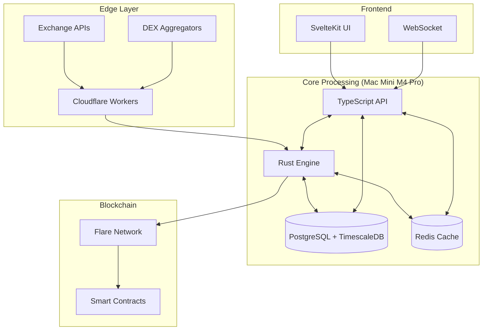

# 🚀 PROJECT CHRONO - FTSO Oracle

*"Chrono boost activated! Time is a flat circle, but prices are multidimensional."*

## 🎮 StarCraft 2 Themed FTSO Oracle

Project Chrono is a high-performance Flare Time Series Oracle (FTSO) implementation featuring a hybrid edge + self-hosted architecture. Built with the efficiency and strategic thinking of the Protoss, it combines Rust's performance with TypeScript's ecosystem for optimal price data processing.

### ⚡ Key Features

- **Multi-Source Price Aggregation**: VWAP, TWAP, weighted median calculations with ML-powered outlier detection
- **Hybrid Architecture**: Edge collection via Cloudflare Workers + self-hosted Mac Mini M4 Pro processing
- **High Performance**: Rust core engine with TypeScript API layer using Bun runtime
- **Real-Time Updates**: WebSocket streaming with Redis pub/sub for instant price feeds
- **Enterprise Monitoring**: Prometheus + Grafana with custom FTSO metrics and SLA tracking
- **Production Security**: Multi-layer security, automated backups, disaster recovery

## 🏗️ Architecture Overview


```mermaid
graph TB
    subgraph "Edge Layer"
        CF[Cloudflare Workers]
        API1[Exchange APIs]
        API2[DEX Aggregators]
    end
    
    subgraph "Core Processing (Mac Mini M4 Pro)"
        RE[Rust Engine]
        TS[TypeScript API]
        DB[(PostgreSQL + TimescaleDB)]
        RD[(Redis Cache)]
    end
    
    subgraph "Blockchain"
        FL[Flare Network]
        SC[Smart Contracts]
    end
    
    subgraph "Frontend"
        SV[SvelteKit UI]
        WS[WebSocket]
    end
    
    CF --> RE
    API1 --> CF
    API2 --> CF
    RE <--> DB
    RE <--> RD
    TS <--> RE
    TS <--> DB
    TS <--> RD
    RE --> FL
    FL --> SC
    SV --> TS
    WS --> TS
```

## 🎯 StarCraft 2 Themed Components

### 🏗️ Nexus Construction (Core Infrastructure)

- **Mac Mini M4 Pro**: The command center powering all operations
- **Multi-Language Runtime**: Rust + TypeScript + Bun + Deno toolchain
- **Database Cluster**: PostgreSQL with TimescaleDB + Redis cache
- **Security Systems**: Advanced hardening and monitoring

### ⚡ Chrono Boost Network (Data Collection)

- **Cloudflare Workers**: Edge-distributed price collection
- **Exchange Integration**: Coinbase, Binance, Kraken, Bybit, OKX
- **Data Validation**: Real-time outlier detection and filtering
- **Rate Management**: Smart quota and error handling

### 🧠 Khala Connection (ML & Analytics)

- **Rust Core Engine**: High-performance price aggregation
- **ML Pipeline**: Anomaly detection and market prediction
- **Consensus Algorithm**: Multi-source truth determination
- **Performance Optimization**: Zero-copy operations and SIMD

### 🌐 Warp Gate Portal (User Interface)

- **SvelteKit Dashboard**: Modern, reactive user interface
- **Real-Time Updates**: WebSocket price feeds and notifications
- **Wallet Integration**: MetaMask, WalletConnect support
- **Analytics**: Performance metrics and delegation tracking

### ⚔️ Protoss Fleet (Flare Integration)

- **FTSO Submission**: Automated price oracle submissions
- **Smart Contracts**: Delegation and reward management
- **Reward Distribution**: Automatic FLR reward calculations
- **Network Monitoring**: Competition analysis and optimization

## 🚀 Quick Start

### Prerequisites

- macOS (Mac Mini M4 Pro recommended)
- Internet connection for downloading packages

### Development Environment Setup (15-20 minutes)

1. **Clone the repository**

   ```bash
   git clone https://github.com/alexsmith84/project-chrono.git
   cd project-chrono
   ```

2. **Run the automated setup script**

   ```bash
   ./scripts/helpers/dev-setup-auto.sh
   ```

   This will automatically install:
   - Homebrew (if not present)
   - Rust toolchain (rustc, cargo, clippy, rustfmt)
   - Bun runtime (JavaScript/TypeScript)
   - PostgreSQL 16 with TimescaleDB
   - Redis cache
   - Development tools (git, gh, jq)

3. **Verify installation**

   ```bash
   rustc --version    # Should show 1.90+
   bun --version      # Should show 1.2+
   psql --version     # Should show 16.10+
   redis-cli ping     # Should return PONG
   ```

4. **Install project dependencies**

   ```bash
   bun install
   ```

**For detailed setup instructions, see:**
- Automated Setup: `docs/implementation/CHRONO-003-guide.md`
- Manual Setup: `docs/setup/mac-mini-setup.md` (production hardening)
- Verification: `docs/tests/CHRONO-003-tests.md`

## 🔗 Live Deployment

When deployed, Project Chrono will be accessible at:

- **🏗️ Main Oracle**: `nexus.hayven.xyz` - Core FTSO hub and API
- **🔍 Data Collection**: `probe.hayven.xyz` - Edge data collection status
- **🧠 Analytics**: `forge.hayven.xyz` - ML processing and insights
- **🌐 Public API**: `gateway.hayven.xyz` - Developer API access
- **⚔️ Admin Dashboard**: `templar.hayven.xyz` - System monitoring and control

## 📊 Performance Targets

| Component | Performance Target | Technology |
|-----------|-------------------|------------|
| Price Aggregation | <10ms calculation | Rust |
| API Response | <200ms (95th percentile) | TypeScript/Bun |
| WebSocket Updates | <50ms latency | Redis pub/sub |
| Database Queries | <50ms complex queries | PostgreSQL + TimescaleDB |
| System Uptime | 99.9% availability | Multi-layer redundancy |

## 🏷️ Team Composition (StarCraft Themed)

- **🟡 Probe** - Data Engineering (Resource gathering from exchanges)
- **🔵 Zealot** - Frontend Development (First contact with users)
- **🔴 High Templar** - Blockchain Integration (Powerful Web3 abilities)
- **🟢 Marine** - DevOps & Infrastructure (Reliable backbone)
- **🟣 Overlord** - Backend Development (Oversees system architecture)
- **🟠 SCV** - Quality Assurance (Maintains code quality)

## 🎫 Development Workflow

### Spec-First Development with Multi-Layer Enforcement

Project Chrono uses a **disciplined, specification-first workflow** with automated enforcement at three layers:

#### 📋 The Three-Document System

Every ticket requires **3 documents created BEFORE any implementation**:

1. **Specification** (`docs/specs/CHRONO-XXX-*.md`)
   - What to build, why, and acceptance criteria
   - Technical architecture and design decisions
   - ~300-500 words

2. **Implementation Guide** (`docs/implementation/CHRONO-XXX-guide.md`)
   - Step-by-step how-to checklist
   - Common pitfalls and debugging tips
   - ~500-800 words

3. **Test Specification** (`docs/tests/CHRONO-XXX-tests.md`)
   - Unit, integration, and E2E test cases
   - Manual verification steps
   - Performance and security requirements
   - ~200-400 words

**Why this works**: Specifications reduce token usage by 50-70% vs discovery-driven development and prevent scope creep.

### Quick Start: Working on a Ticket

#### Step 1: Create GitHub Issue

```bash
# Create issue titled: "CHRONO-123: Your feature description"
gh issue create --title "CHRONO-123: Feature description" \
  --body "Context here..."
```

#### Step 2: Create the 3 Documentation Files

**Create specification** (`docs/specs/CHRONO-123-short-name.md`):
```markdown
# CHRONO-123: Short Feature Name

## Context
Why are we building this?

## Requirements
What needs to be built?

## Acceptance Criteria
How do we know it's done?
```

**Create implementation guide** (`docs/implementation/CHRONO-123-guide.md`):
```markdown
# CHRONO-123: Implementation Guide

## Prerequisites
What tools/knowledge are needed?

## Step-by-Step Checklist
1. [ ] First step
2. [ ] Second step
...

## Common Pitfalls
Watch out for...

## Debugging Tips
If something breaks...
```

**Create test specification** (`docs/tests/CHRONO-123-tests.md`):
```markdown
# CHRONO-123: Test Specification

## Unit Tests
Test cases for...

## Integration Tests
End-to-end scenarios...

## Manual Verification
How to verify manually...
```

#### Step 3: Update GitHub Issue

Link all 3 docs in the issue description:
```
## Documentation
- docs/specs/CHRONO-123-*.md - Specification
- docs/implementation/CHRONO-123-guide.md - Implementation guide
- docs/tests/CHRONO-123-tests.md - Test specification
```

#### Step 4: Use Claude Code to Begin

```bash
# Load ticket context
/ticket CHRONO-123

# Validate all docs exist
/spec-ready CHRONO-123

# Begin implementation with pre-work checklist
/start-work
```

#### Step 5: Create Feature Branch and Implement

```bash
# Create feature branch
git checkout -b CHRONO-123-your-feature

# Git hooks will:
# ✅ Block commits without 3 docs
# ✅ Auto-inject "CHRONO-123:" into commit messages
# ✅ Enforce commit message format

# Commit after each major step
git add .
git commit -m "Descriptive message"  # Auto-becomes: CHRONO-123: Descriptive message
```

#### Step 6: Create PR and Merge

```bash
# Push branch
git push origin CHRONO-123-your-feature

# Create PR
gh pr create --title "CHRONO-123: Your feature" \
  --body "Fixes #123

See documentation:
- docs/specs/CHRONO-123-*.md
- docs/implementation/CHRONO-123-guide.md
- docs/tests/CHRONO-123-tests.md"

# GitHub Actions will:
# ✅ Extract ticket number from PR title
# ✅ Verify all 3 docs exist
# ✅ Block merge if docs missing
# ✅ Allow merge when all docs present
```

#### Step 7: Close Loop

```bash
# Merge PR when tests pass
gh pr merge <pr-number>

# Close issue
gh issue close <issue-number> \
  --comment "Completed via PR #<pr-number>"

# Update project board
gh project item-edit <item-id> --status Done
```

### Multi-Layer Enforcement System

#### Layer 1️⃣: Git Hooks (Local Machine)

Enforced via **Husky** when you commit:

- **pre-commit**: Validates all 3 docs exist (blocks if missing)
- **prepare-commit-msg**: Auto-injects CHRONO-123 into commit messages
- **commit-msg**: Enforces format "CHRONO-XXX: Description"

Example:
```bash
$ git commit -m "Add feature"
CHRONO-123: Add feature  # Auto-prefixed!

$ git commit -m "Fix bug"  # On branch without CHRONO-XXX
❌ Commit blocked - missing docs
```

#### Layer 2️⃣: GitHub Actions (Remote CI/CD)

Enforced when you create a PR:

- Extracts ticket number from PR title or branch name
- Verifies `docs/specs/CHRONO-XXX-*.md` exists
- Verifies `docs/implementation/CHRONO-XXX-guide.md` exists
- Verifies `docs/tests/CHRONO-XXX-tests.md` exists
- **Blocks merge** if any doc is missing

Example:
```
PR #42: "CHRONO-123: Add feature"
  ↓
GitHub Actions ticket-validation.yml runs
  ✅ Extract ticket: CHRONO-123
  ✅ Spec exists
  ✅ Implementation guide exists
  ✅ Test spec exists
  ✓ All checks passed!
```

#### Layer 3️⃣: Claude Code (IDE/Session)

Guided workflow in Claude Code:

- **CLAUDE.md**: Project workflow guide loaded on session start
- **Slash commands**: `/ticket`, `/spec-ready`, `/start-work`
- **Reference guides**: Svelte 5 patterns, Bun compatibility, etc.
- **Hooks**: Detect ticket patterns and suggest best practices

### Reference Documents

Available when you start a new Claude Code session:

- **Pre-Ticket Checklist** (`docs/claude/pre-ticket-checklist.md`)
- **Implementation Phases** (`docs/claude/implementation-phases.md`)
- **Backend Patterns** (`docs/claude/backend-patterns.md`)
- **Frontend Patterns** (`docs/claude/frontend-patterns.md`)
- **Svelte 5 Reference** (`docs/reference/svelte5-patterns.md`)
- **Bun Compatibility** (`docs/reference/bun-compatibility.md`)

### Common Workflow Problems & Solutions

#### ❌ "Git hook blocks my commit"

**Solution**: You're missing one of the 3 required docs.

```bash
# Check which docs exist
ls docs/specs/CHRONO-123-*.md       # Should exist
ls docs/implementation/CHRONO-123-guide.md  # Should exist
ls docs/tests/CHRONO-123-tests.md   # Should exist

# If any are missing, create them before committing
```

#### ❌ "GitHub Actions blocks my PR"

**Solution**: Check the workflow logs - a doc file is likely missing.

```bash
# Go to PR > Checks > ticket-validation
# See which doc is missing
# Add the missing file and push again
```

#### ❌ "I need to deviate from the spec"

**Solution**: Create a follow-up ticket instead of expanding the current one.

This keeps scope predictable and token usage under control. Document the change as a reason for the follow-up ticket.

### Supply Cost Estimation (StarCraft Style)

- **1 Supply** (XS) - Marine/Zealot level tasks
- **2 Supply** (S) - Stalker/Marauder level features
- **3 Supply** (M) - High Templar/Ghost level complexity
- **5 Supply** (L) - Colossus/Thor level major systems
- **8 Supply** (XL) - Carrier/Battlecruiser level epic implementations

### Project Management

- **GitHub Projects**: Roadmap view with StarCraft-themed epics
- **Issue Tracking**: Comprehensive tickets with supply cost estimation
- **CI/CD Pipeline**: Multi-language testing and deployment
- **Quality Gates**: Code coverage, security scanning, performance tests

## 📈 Business Model

### Revenue Streams

- **FTSO Rewards**: Earn FLR tokens for accurate price submissions
- **Delegation Fees**: 10-20% fee from user delegations
- **API Services**: Premium access for DeFi applications
- **Consulting**: FTSO setup and optimization services

### Target Metrics

- **Delegation Goal**: 100M+ FLR tokens delegated
- **Accuracy Target**: Top 25% of FTSO providers
- **Uptime Goal**: 99.9% availability
- **Market Share**: 5%+ of total FTSO voting power

## 🔒 Security Features

- **Multi-Layer Security**: Network, application, and data security
- **Automated Backups**: Encrypted offsite storage with 15-minute RTO
- **Intrusion Detection**: Real-time threat monitoring and response
- **Penetration Testing**: Regular security assessment and validation
- **Compliance**: Financial regulations and data protection standards

## 📚 Documentation

- **Architecture Guide**: Detailed system design and component interactions
- **API Documentation**: OpenAPI specs with interactive examples
- **Deployment Guide**: Production setup and configuration
- **Troubleshooting**: Common issues and solutions
- **Contributing**: Development guidelines and code standards

## 🤝 Contributing

We welcome contributions from the community! Please read our [Contributing Guidelines](CONTRIBUTING.md) and follow the Protoss Code of Honor:

1. **Write clean, efficient code** - Optimize for performance and readability
2. **Test thoroughly** - All code must have comprehensive tests
3. **Document everything** - Help others understand your contributions
4. **"My life for Aiur!"** - Contribute to the greater good of DeFi

## 📄 License

This project is licensed under the MIT License - see the [LICENSE](LICENSE) file for details.

## 🙏 Acknowledgments

- **Flare Network** - For building the infrastructure that makes FTSO possible
- **StarCraft 2** - For inspiring our project's theme and terminology
- **Open Source Community** - For the tools and libraries that power this project
- **FTSO Community** - For sharing knowledge and best practices

## 📞 Support

- **Documentation**: [docs.hayven.xyz](https://docs.hayven.xyz)
- **Issues**: [GitHub Issues](https://github.com/your-username/project-chrono/issues)
- **Discussions**: [GitHub Discussions](https://github.com/your-username/project-chrono/discussions)
- **Discord**: [Project Chrono Community](https://discord.gg/project-chrono)

---

*En Taro Tassadar! For Aiur... and accurate price feeds!* ⚡

**May the Khala guide your coding journey!**
